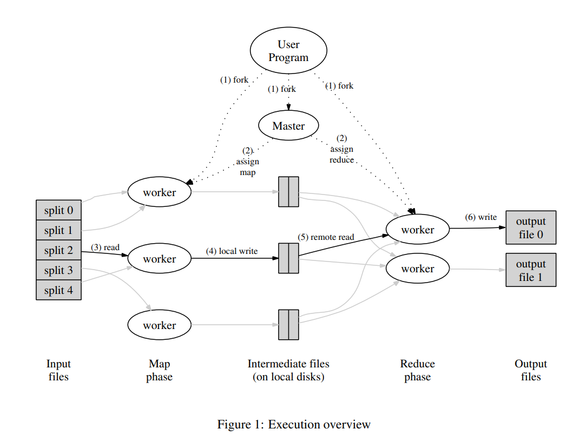

# Map-reduce

## Motivation

There are hundreds of programming models to handle some data sets. But the Google has some problems to handle
their data sets.

- The input data is large.
- The computations have to be distributed across more than hundreds of machines.

To handle those data sets, the below detalis must be implemented.

- how to parallelized the computation
- how to distribute the data
- how to handle failures

After Google implemented hundreds of such programming models, they made an abstraction of them, that is
Map-reduce model.

## Model definition

The programming model can be defined as the input and output of its execution. There are three execution model
on Map-reduce model, that are the full program, map function and reduce function.

- A computation
    - Input: a set of key/value pair
    - Output: a set of key/value pair
- Map: the function of producing intermediate key/value pair
    - Input: a key/value pair
    - Output: a set of intermediate key/value pairs
- Reduce: the function of producing intermediate key/value pair
    - Input: an intermediate key I and a set of values for that key.
    - Output: the desired ouput on the given intermediate key I
      With pseudocode, we can write as below. The specific implementation needs to be written by the developers.

```
def program(input: Pair<K, V>): Output<K, O>
  do 

def map(input: Pair<K, V>): Set<Intermediate<T, W>>
  do

def reduce(key: T, intermediates: Set<Intermediate<T, W>>): Output<K, O>
  do
```

## Implementation on Google

### Distributed execution



In general, a MapReduce library will be implemented by following the below steps. The below is came from the
paper.

1. The MapReduce library in the user program first splits the input files into M pieces of typically 16
   megabytes to 64 megabytes (MB) per piece (controllable by the user via an optional parameter). It then starts
   up many copies of the program on a cluster of machines.
2. One of the copies of the program is special – the master. The rest are workers that are assigned work by the
   master. There are M map tasks and R reduce tasks to assign. The master picks idle workers and assigns each
   one a map task or a reduce task.
3. A worker who is assigned a map task reads the contents of the corresponding input split. It parses key/value
   pairs out of the input data and passes each pair to the user-defined Map function. The intermediate key/value
   pairs produced by the Map function are buffered in memory.
4. Periodically, the buffered pairs are written to local disk, partitioned into R regions by the partitioning
   function. The locations of these buffered pairs on the local disk are passed back to the master, who is
   responsible for forwarding these locations to the reduce workers.
5. When a reduce worker is notified by the master about these locations, it uses remote procedure calls to read
   the buffered data from the local disks of the map workers. When a reduce worker has read all intermediate
   data, it sorts it by the intermediate keys so that all occurrences of the same key are grouped together. The
   sorting is needed because typically many different keys map to the same reduce task. If the amount of
   intermediate data is too large to fit in memory, an external sort is used.
6. The reduce worker iterates over the sorted intermediate data and for each unique intermediate key
   encountered, it passes the key and the corresponding set of intermediate values to the user’s Reduce
   function. The output of the Reduce function is appended to a final output file for this reduce partition.
7. When all map tasks and reduce tasks have been completed, the master wakes up the user program. At this point,
   the MapReduce call in the user program returns back to the user code.

This can be simplified as below psuedocodes.

```
// Worker
def Worker.invoke(func: Function, args: Array)
  result := func(args)
  buffer(result)
  return bufferedResult

// MapReduce maseter
def process(input: Pair<K, V>): Output<K, O>
  workers = find computation workers
  mapWorkers = assign workers to do map functions
  reduceWorkers assign workers to do reduce functions

  for splittedInput = split input to M inputs; do
    await mapWorkers.invoke(map, splittedInput)
      .thenFlatten { intermediates -> findIdleWorker(reduceWorkers).invoke(reduce, key, intermediates) }
      .then(::bufferResult)
  return bufferredResult

// User-defined map function
def map(input: Pair<K, V>): Set<Intermediates<T, W>>
  do user defined map process

// User-defined reduce function
def reduce(key: T, intermediates: Set<Intermediate<T, W>>): Output<K, O>
  do user defined reduce process
```

## Data structures on master

WIP

## Fault Tolerance

WIP

## Locality

WIP

## Task Granularity

WIP

## Backup tasks

WIP

# Refinements

WIP

# Reference

- https://static.googleusercontent.com/media/research.google.com/ko//archive/mapreduce-osdi04.pdf